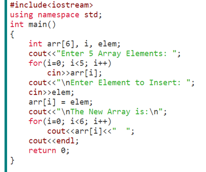
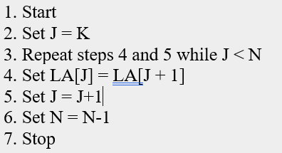

IET DEPARTMENT

{width="3.3854166666666665in"
height="3.3958333333333335in"}

Data Structure and Algorithms

Lab Manual

**[\
]{.underline}**

**[Lab 2: Arrays]{.underline}**

**Objectives**

-   Revision of OOP Concepts-Arrays & Pointers

-   Revision and Practice on Arrays

-   CRUD (create, read, update and delete) Operations on Arrays

**Introduction**

An array is used to process a collection of data all of which is of same
type, such as a list of temperatures or list of names. An array is used
to store a collection of data, but it is often more useful to think of
an array as a collection of variables of the same type.

For example, you want to store the score of 5 students, you can declare
5 variables, int student1, student2, student3, student4, student5;

Now what if the scenario changes and now we want to store the score of
100 students?

So instead of declaring individual variables, you declare one array
variable such as students and use students \[0\], students \[1\], and
\..., students \[99\] to represent individual variables.

In this lab you will revise the basic working of arrays and pointers

**Activity Time boxing**

  -----------------------------------------------------------------------
  **Task No.** **Activity Name**       **Activity       **Total Time**
                                       time**           
  ------------ ----------------------- ---------------- -----------------
               Lab Manual Lecture      30 min           

               Examples                20 min           

               Walkthrough Tasks       20 min           

               Practice Tasks          75 min           

               Tasks Evaluation/Viva   35 min           180 minutes
  -----------------------------------------------------------------------

**Lab Manual Lecture \[Expected time = 30 minutes\]**

-   Concepts of Data Structure

-   What is Array

-   CRUD operations on Arrays

-   Pointers

**Concept Map**

**What is a data structure?**

It is a data organization, management and storage format that enables
efficient access and modification.

Examples are arrays, Lists, Binary trees, Heaps.

Today we will discuss and revise arrays.

**Arrays:** An array is a collection of data that holds fixed number of
values of same type. For example: int age\[100\];

Here, the age array can hold maximum of 100 elements of integer type.
The size and type of arrays cannot be changed after its declaration.

**Declaring array:**

type arrayName \[ arraySize\];

int students \[5\];

Initializing array: students = {10, 8, 9, 5,7};

**Sample Program**

#include \<iostream\>

using namespace std;

int main () {

int students \[ 5\], i; // n is an array of 5 integers

// initialize elements of array

cout \<\< \"Enter marks\" \<\<endl;

for (int i = 0; i \< 5; i++)

{

cin\>\>students\[i\]; }

// output each array element\'s value

for (int i = 0; i \< 5; i++)

{cout \<\< \"Student\" \<\<i\<\< \"scored\" \<\<students\[i\] \<\<
\"marks\" \<\<endl;}

return 0;}

**Array Operations**

There are some basic operations that can be performed on array which are
adding data element to array, searching and updating particular data
element in an array and deleting data element from array. In this lab
the detailed description of these operations

Following are the basic operations supported by an array.

-   Traverse − print all the array elements one by one.

-   Insertion − Adds an element at the given index.

-   Deletion − Deletes an element at the given index.

-   Search − Searches an element using the given index or by the value.

-   Update − Updates an element at the given index.

I.  **Traverse Operation**

This operation is to traverse through the elements of an array.
Following program traverses and prints the elements of an array:

#include \<iostream\>

#include \<stdio.h\>

using namespace std;

int main()

{ int LA\[\] = {1,3,5,7,8};

int n = 5;

int i = 0, j = n;

cout\<\< \"The original array elements are\"\<\<endl;

for(i = 0; i\<n; i++) {

cout\<\< LA\[i\]\<\<endl;

}

return 0;}

II. **Insertion Operation**

Insert operation is to insert one or more data elements into an array.
Based on the requirement, a new element can be added at the beginning,
end, or any given index of array.

add data at the end of the array

{width="3.5749004811898515in"
height="2.9819903762029747in"}

III. **Add data at the specific position of the array**

#include \<iostream\>

using namespace std;

int main()

{

int array\[100\], position, c, n, value;

cout\<\<\"Enter number of elements in array\\n\"\<\<endl;

cin\>\>n;

cout\<\<\"Enter elements\\n\"\<\<endl;

for (c = 0; c \< n; c++)

{cin\>\>array\[c\]; }

cout\<\<\"Enter the location where you wish to insert an
element\\n\"\<\<endl;

cin\>\>position;

cout\<\<\"Enter the value to insert\\n\"\<\<endl;

cin\>\>value;

for (c = n - 1; c \>= position - 1; c\--)

{ array\[c+1\] = array\[c\];}

array\[position-1\] = value;

cout\<\<\"Resultant array is\\n\"\<\<endl;

for (c = 0; c \<= n; c++)

{ cout\<\<array\[c\]; }

return 0;}

IV. **Update Operation**

void Update Values ()

{ cout\<\<\"Enter Index Number to Update Value:\";g

int index;

cin\>\>index;

cout\<\<\"Enter the New Value For Index array \[ \"\<\<index\<\<\" \] =
\";

cin\>\>array\[index\];

cout\<\<\"Array Updated\... Successfully \"\<\<endl;}

V.  **Search Operation**

1\. First take number of elements in array as input from user and store
it in a variable size.

2\. Using a loop, take input from user and store it in array (Let the
name of the array be inputArray).

3\. Ask user to enter element to be searched. Let it be num.

4\. Now, using a for loop, traverse inputArray from index 0 to size-1
and compare num with every array element. If num is equal to any array
element then print a message saying \"Element found at index 4\"
otherwise print \"Element Not Present\".

VI. **Delete Operation**

Deletion refers to removing an existing element from the array and
re-organizing all elements of an array.

**Algorithm**

Consider LA is a linear array with N elements and K is a positive
integer such that K\<=N. Following is the algorithm to delete an element
available at the Kth position of LA.

{width="2.689527559055118in"
height="1.460223097112861in"}

#include \<iostream\>

#include \<stdio.h\>

using namespace std;

int main()

{ int del; int count;

int array\[10\],m;

cout\<\<\"Enter the size of your array:\";

cin\>\>m;

for(int i=0;i\<m; i++)

{cin\>\>array\[i\];}

cout\<\<\"Enter the number to delete\"\<\<endl;

cin\>\>del;

for (int i=0; i\<m; i++)

{if(array\[i\]==del)

[{for (int j=i; j\<(m-1); j++)]{.mark}

[{array\[j\]=array\[j+1\]; }]{.mark}

[count++;]{.mark}

[break;]{.mark}

} }

if(count==0) {

cout\<\<\"Element not found\...!!\";

}

else {

cout\<\<\"Element deleted successfully\...!!\\n\"; cout\<\<\"Now the new
array is :\\n\";

for(int i=0; i\<(m-1); i++)

{

cout\<\<array\[i\]\<\<\" \";

}}

return 0;}

**Pointers**

A pointer is a variable whose value is the address of another variable.
Like any variable or constant, you must declare a pointer before you can
work with it. The general form of a pointer variable declaration is −

type \*var-name;

Here, type is the pointer\'s base type; it must be a valid C++ type and
var-name is the name of the pointer variable. The asterisk you used to
declare a pointer is the same asterisk that you use for multiplication.
However, in this statement the asterisk is being used to designate a
variable as a pointer. Following are the valid pointer declaration −

int \*ip; // pointer to an integer

double \*dp; // pointer to a double

float \*fp; // pointer to a float

char \*ch // pointer to character

**Use of Pointers**

There are few important operations, which we will do with the pointers
very frequently.

\(a\) We define a pointer variable.

\(b\) Assign the address of a variable to a pointer.

\(c\) Finally access the value at the address available in the pointer
variable.

This is done by using unary operator \* that returns the value of the
variable located at the address specified by its operand.

**How to use a pointer?**

-   Define a pointer variable

-   Assigning the address of a variable to a pointer using unary
    operator (&) which returns the address of that variable.

-   Accessing the value stored in the address using unary operator (\*)
    which returns the value of the variable located at the address
    specified by its operand.

The reason we associate data type to a pointer is that it knows how many
bytes the data is stored in. When we increment a pointer, we increase
the pointer by the size of data type to which it points.

**Reference operator (&) and Deference operator (\*)**

Reference operator (&) as discussed above gives the address of a
variable.

To get the value stored in the memory address, we use the dereference
operator (\*).

For example: If a number variable is stored in the memory address 0x123,
and it contains a value 5.

The reference (&) operator gives the value 0x123, while the dereference
(\*) operator gives the value 5.

**Example**

#include \<iostream\>

using namespace std;

int main() {

int \*pc, c;

c = 5;

cout \<\< \"Address of c (&c): \" \<\< &c \<\< endl;

cout \<\< \"Value of c (c): \" \<\< c \<\< endl \<\< endl;

pc = &c; // Pointer pc holds the memory address of variable c

cout \<\< \"Address that pointer pc holds (pc): \"\<\< pc \<\< endl;

cout \<\< \"Content of the address pointer pc holds (\*pc): \" \<\< \*pc
\<\< endl \<\< endl;

c = 11; // The content inside memory address &c is changed from 5 to 11.

cout \<\< \"Address pointer pc holds (pc): \" \<\< pc \<\< endl;

cout \<\< \"Content of the address pointer pc holds (\*pc): \" \<\< \*pc
\<\< endl \<\< endl;

\*pc = 2;

cout \<\< \"Address of c (&c): \" \<\< &c \<\< endl;

cout \<\< \"Value of c (c): \" \<\< c \<\< endl \<\< endl;

return 0;

}

**Output**

Address of c (&c): 0x7fff5fbff80c

Value of c (c): 5

Address that pointer pc holds (pc): 0x7fff5fbff80c

Content of the address pointer pc holds (\*pc): 5

Address pointer pc holds (pc): 0x7fff5fbff80c

Content of the address pointer pc holds (\*pc): 11

Address of c (&c): 0x7fff5fbff80c

Value of c (c): 2

**NULL Pointers**

A pointer that is assigned NULL is called a null pointer.

The NULL pointer is a constant with a value of zero defined in several
standard libraries, including iostream.

**Void Pointer**

A void pointer is a pointer that has no associated data type with it. A
void pointer can hold address of any type and can be type casted to any
type.

int a = 10;

char b = \'x\';

void \*p = &a; // void pointer holds address of int \'a\'

p = &b; // void pointer holds address of char \'b\'.

**Pointer and arrays**

While handling arrays with pointers you need to take care few things.
First and very important point to note regarding arrays is that the
array name alone represents the base address of array so while assigning
the address of array to pointer don't use ampersand sign(&). Do it like
this:

p = arr; Correct: Because arr represent the address of array.

p = &arr; Incorrect:

**Example: Traversing the array using Pointers**

#include \<iostream\>

using namespace std;

int main(){

//Pointer declaration

int \*p;

//Array declaration

int arr\[\]={1, 2, 3, 4, 5, 6}

//Assignment

p = arr;

for(int i=0; i\<6;i++){

cout\<\<\*p\<\<endl;

//++ moves the pointer to next int position

p++; }

return 0;}

**Output:**

1

2

3

4

5

6

How to increment pointer address and pointer's value?

When we are accessing the value of a variable through pointer, sometimes
we just need to increment or decrement the value of variable though it
or we may need to move the pointer to next int position(just like we did
above while working with arrays). The ++ operator is used for this
purpose. One of the example of ++ operator we have seen above where we
traversed the array using pointer by incrementing the pointer value
using ++ operator.

**[Lab Topic: Arrays]{.underline}**

> **Task 1: \[Time required: 25 minutes\]**

1.  In this Lab, you will have to implement the basic functions needed
    to build the List based on array as given below. You have to provide
    the implementation of given functions. Suppose we have an array like
    this: (This task has to implemented both by static and dynamic
    allocation)

> **Array1 (Initialize array with capacity 10)**

  ------------------------------------------------------------------------
  **5**          **3**          **8**          **15**        **12**
  -------------- -------------- -------------- ------------- -------------

  ------------------------------------------------------------------------

a.  Function called **Insert** to add any value at the beginning of
    list.

Now array1 will look like this: (If we insert 1 at start of the array)

  -----------------------------------------------------------------------------------
  **[1]{.underline}**   **5**         **3**       **8**       **15**     **12**
  --------------------- ------------- ----------- ----------- ---------- ------------

  -----------------------------------------------------------------------------------

b.  Function called **InsertAtSpecificPosition** to add value at the
    specific position of list.

> Now Array1 will look like this: (If we insert 17 at the 6^th^ location
> of array)

  ------------------------------------------------------------------------------------
  **5**        **3**        **8**        **15**     **12**      **[17]{.underline}**
  ------------ ------------ ------------ ---------- ----------- ----------------------

  ------------------------------------------------------------------------------------

Or If we want to insert 20 at third position.

  ------------------------------------------------------------------------
  **5**          **3**          **8**          **15**        **12**
  -------------- -------------- -------------- ------------- -------------

  ------------------------------------------------------------------------

  --------------------------------------------------------------------------
  **5**       **3**       **20**          **8**       **15**     **12**
  ----------- ----------- --------------- ----------- ---------- -----------

  --------------------------------------------------------------------------

c.  Function called **remove** to remove new value after specific value
    in list.

  ------------------------------------------------------------------------
  **5**          **3**          **8**          **15**        **12**
  -------------- -------------- -------------- ------------- -------------

  ------------------------------------------------------------------------

> If we remove 8 from the array, the array will look like this:

  ------------------------------------------------------------------------
  **5**              **3**              **15**           **12**
  ------------------ ------------------ ---------------- -----------------

  ------------------------------------------------------------------------

d.  Function called **display** to show all data of the array.

  ------------------------------------------------------------------------
  **5**          **3**          **8**          **15**        **12**
  -------------- -------------- -------------- ------------- -------------

  ------------------------------------------------------------------------

**Task 2: \[Time required: 25 minutes\]**

Write a program that lets a maker of chips and salsa keep track of sales
for five different types of salsa: mild, medium, sweet, hot, and zesty.

The program should use two parallel 5-element arrays: an array of
strings that holds the five salsa names and an array of integers that
holds the number of jars sold during the past month for each salsa type.
The salsa names should be stored using an initialization list at the
time the name array is created.

The program should prompt the user to enter the number of jars sold for
each type. Once this sales data has been entered, the program should
produce a report that displays sales for each salsa type, total sales,
and the names of the highest-selling product.

Input Validation: Do not accept negative values for the number of jars
sold.
